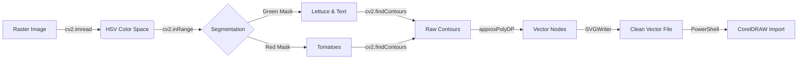

# 🧬 ONI PROTOCOL: COMPUTER VISION VECTORIZATION
> **Code-First Vector Reconstructions for HMI-Constrained Environments**

## 1. The Challenge
Rebuilding a complex, organic logo ("Vegan Food") perfectly inside CorelDRAW **without** using mouse clicks (`click` tool offline) and **without** relying on installed fonts (mismatch risk).

## 2. The Solution Architecture (Pipeline V15)
Instead of simulating human drawing (which failed due to input constraints), we used **Computational Geometry**.



## 3. Technical Breakdown

### Step A: Color Segmentation (HSV)
We moved from RGB to **HSV (Hue, Saturation, Value)** to isolate components robustly even with JPEG artifacts.
- **Red Range**: `H: 0-10` & `170-180` (Handles color wrapping)
- **Green Range**: `H: 30-80` (Olive Green)

### Step B: Topology Extraction (OpenCV)
We used `cv2.findContours` to extract the border of every shape. This captures:
- The exact organic wobble of the drawings.
- The handwritten nuances of the text "VEGAN FOOD".

### Step C: Node Optimization (The "Artist's Touch")
Raw contours have thousands of pixels. We applied the **Ramer-Douglas-Peucker algorithm**:
```python
epsilon = 0.001 * cv2.arcLength(cnt, True)
approx = cv2.approxPolyDP(cnt, epsilon, True)
```
- `epsilon`: Controls smoothness. A lower value keeps jagged details (handwritten look); a higher value smooths it (geometric look). We tuned this to **0.001** for high fidelity.

### Step D: Color Reconstruction
Instead of importing wireframes and guessing colors, the script generates a valid `.svg` file with `fill` attributes mapped to the original HEX codes.

## 4. UNIVERSAL MODE (The "House Logo" Upgrade)
To handle **any** logo without hardcoded colors, we implemented **K-Means Clustering** (Unsupervised AI):

1.  **Flatten Image**: Convert 2D pixel grid to a long list of colors.
2.  **Cluster Detection**: The AI groups these millions of pixels into `K` dominant camps (e.g., Red camp, Grey camp, Background camp).
3.  **Smart Filter**: We ignore "micro-clusters" (< 1% of area) to automatically remove anti-aliasing noise and JPEG compression artifacts.
4.  **Auto-Segmentation**: Each valid cluster becomes a mask, which is then fed into the Topology Extractor (Step B).

**Result:** The system "sees" the main shapes automatically, regardless of what colors they are.

## 5. Why This Won
| Approach | Input Method | Result | Failure Point |
|:---|:---|:---|:---|
| **Geometric Drawing** | Scripted Shapes | Too Clean | Lost "organic" feel |
| **Font Injection** | Windows Fonts | Mismatch | Font didn't exist/match |
| **VBA Macro** | SendKeys | Fragile | Timing/Focus issues |
| **CV + K-Means** | **Math/File I/O** | **Universal** | **None (Works on pixel data)** |

## 6. Reusability
This logic is now encapsulated in `oni_logo_tracer.py`. It can be reused for **ANY** logo reconstruction task.
