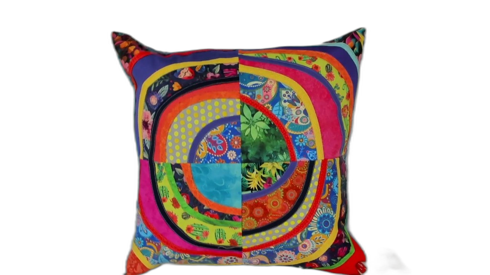
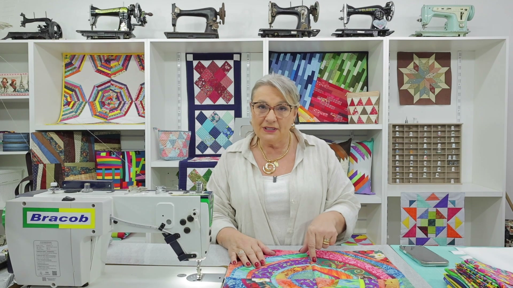
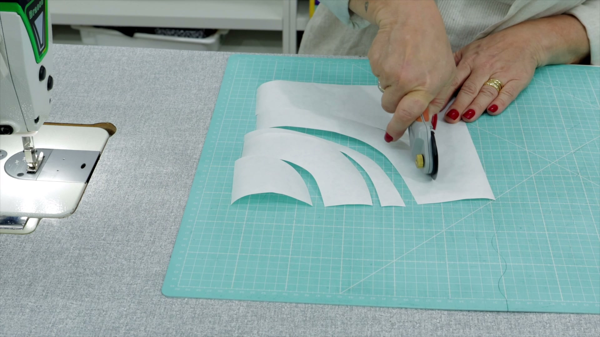
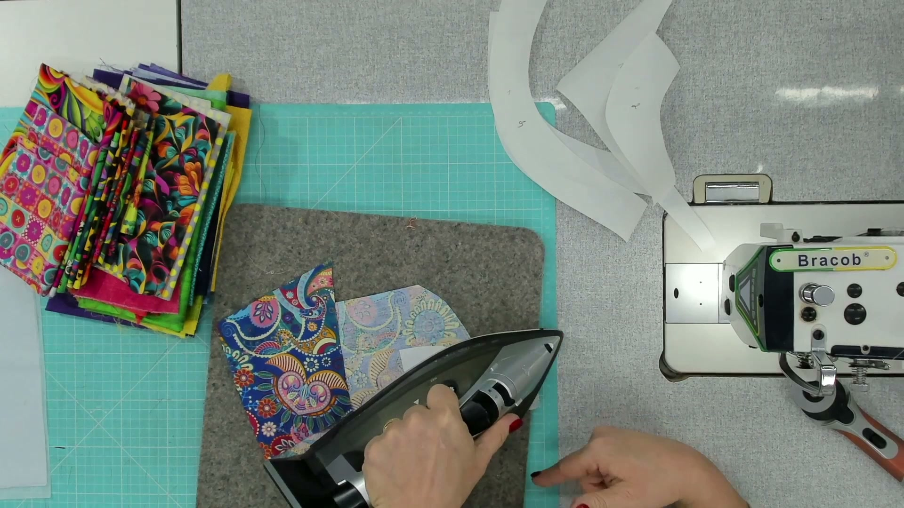
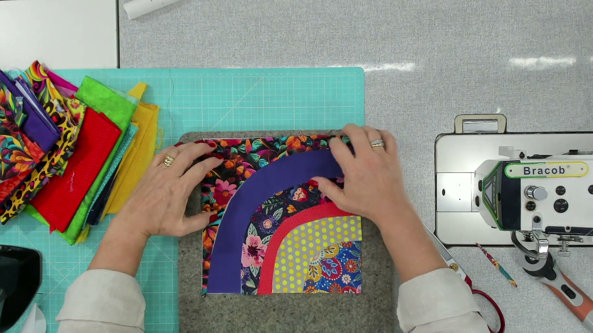
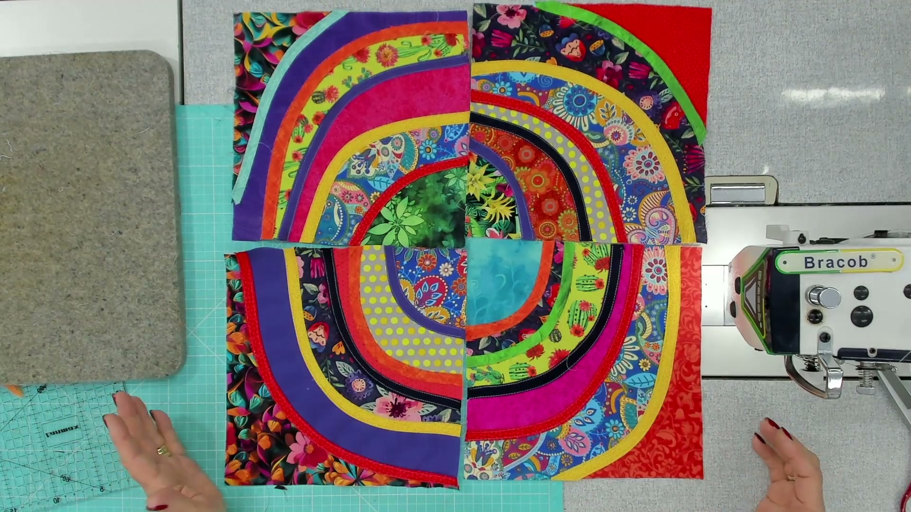

    <!-- Decor Background -->
    

    

    
    <!-- Content -->
    
    

        
    

    
    

        
AULA 10

        
ALMOFADA ORGÂNICA

        
TÉCNICA COM FREEZER PAPER

    

    
    

        CURSO DE PEÇAS COM RETALHOS • 2026
    

# Introdução

> **Resumo da Aula**: Nesta aula, você aprenderá uma técnica incrível e fácil para criar formas circulares perfeitas usando *Freezer Paper*. É ideal para aproveitar retalhos e criar designs orgânicos e modernos.

---

## 1. Lista de Materiais

Para este projeto, você precisará de:

*   **Freezer Paper** (Papel de congelamento simples ou comprado)
*   **Tecidos de Algodão (Tricoline)**: Várias estampas e cores (Retalhos grandes)
*   **Tecido de Forro e Costas**: Tecido liso ou estampado para a parte de trás
*   **Entretela Fina (colante ou não)**: Para estruturar o bloco
*   **Manta Acrílica (R1 ou R2)**: Para o sanduíche
*   **Zíper de Nylon**: 60 cm (ou maior que a almofada)
*   **Ferro de Passar**
*   **Tesoura e Máquina de Costura**

---

## 2. LISTA DE CORTE (Por Bloco)

    
    
Para cada quadrado de 25cm (um módulo da almofada):

    <ul>
        <li><strong>[ 1x ]</strong> Quadrado de Freezer Paper de <strong>25cm x 25cm</strong> (para o molde)</li>
        <li><strong>[ 1x ]</strong> Quadrado de Entretela de <strong>25cm x 25cm</strong> (para a base)</li>
        <li><strong>[ 6x ]</strong> Retalhos de Tecido suficientes para cobrir as partes do desenho</li>
        <li><strong>[ Vários ]</strong> Tiras de Viés (cortadas na diagonal) com <strong>3 cm de largura</strong>
            <ul>
                <li><em>Quantidade</em>: O suficiente para contornar todas as emendas do bloco.</li>
            </ul>
        </li>
    </ul>

> **Nota**: Para uma almofada completa de 50x50cm, você precisará repetir este corte **4 vezes** (fazer 4 blocos).

---

## 3. Entendendo a Técnica: O que é Freezer Paper?

O **Freezer Paper** é um papel especial que possui uma fina camada plástica/cerosa em um dos lados.
*   **Lado Fosco**: Onde você desenha.
*   **Lado Brilhante**: Onde ocorre a aderência ao tecido quando aquecido com ferro.

> **Dica**: Ele pode ser reaproveitado várias vezes! A cola é temporária e não deixa resíduos.

---

## 3. Preparação dos Moldes

Vamos trabalhar com um bloco de **25cm x 25cm**. Neste exemplo, dividiremos o bloco em 6 partes curvas orgânicas.

1.  Corte um quadrado de Freezer Paper de **25cm**.
2.  Desenhe livremente curvas para dividir o quadrado em **6 partes** (ou quantas desejar: 4, 5, 7...).
    *   *Dica*: Varie as espessuras (fino em uma ponta, grosso na outra) para criar movimento.
3.  Numere as partes (1 a 6) para não perder a ordem.
4.  Identifique o conjunto (ex: Letra A, B, C, D) se for fazer múltiplos blocos.

**(Repita este processo para criar 4 blocos diferentes se for fazer a almofada completa de 50x50cm).**

---

## 4. Corte e Aplicação nos Tecidos

Agora vamos transferir os moldes para os tecidos.

1.  **Escolha os Tecidos**: Intercale estampados com texturas lisas para dar destaque.
    
2.  **Aplique o Molde**:
    *   Coloque o **lado brilhante** do Freezer Paper em contato com o **avesso** do tecido.
    *   Passe o ferro quente (sem vapor) em cima do papel. O papel irá aderir ao tecido.
    
3.  **Corte**: Recorte o tecido rente ao papel.
    *   **Atenção**: Nesta técnica, **NÃO** deixamos margem de costura extra neste momento. O viés fará a junção.
    
4.  **Remova o Papel**: Após cortar, puxe delicadamente o papel. Ele sairá facilmente e poderá ser usado no próximo bloco.

---

## 5. Montagem na Base (Entretela)

Com todas as 6 peças do bloco cortadas, vamos montá-las novamente.

1.  Pegue um quadrado de **Entretela Fina** (25cm x 25cm).
2.  Posicione as peças de tecido (1 a 6) sobre a entretela, remontando o desenho original.
    *   *Não sobreponha os tecidos, apenas encoste um no outro.*
3.  Passe o ferro para fixar os tecidos na entretela (se ela for termocolante) ou use um pouco de cola temporária/alfinetes.

---

## 6. Acabamento com Viés (A Mágica!)

Para unir as peças e dar o acabamento, usaremos viés de cores contrastantes.

1.  **Prepare o Viés**:
    *   Corte tiras de tecido (texturas funcionam bem) em viés (corte na diagonal do fio).
    *   Largura da tira: **3 cm**.
    *   Dobre as bordas da tira para o centro (como um viés comprado) usando o ferro.
    
2.  **Aplique o Viés**:
    *   Posicione o viés sobre a junção de dois tecidos.
    *   **Segredo**: Costure primeiro o lado de **fora** da curva (o lado maior). Isso ajuda a assentar.
    *   Costure o outro lado.
    

Repita até cobrir todas as junções do bloco.

---

## 7. Montagem Final da Almofada

Após finalizar os 4 blocos de 25cm:

1.  **Junte os Blocos**: Una os 4 quadrados para formar o painel frontal da almofada (50cm x 50cm).
    *   Cuide para que o encontro central fique perfeito.
    
2.  **Estruture**: Coloque o painel sobre a **Manta Acrílica** e faça costuras simples (quilting livre ou na vala) para prender.
3.  **Colocação do Zíper**:
    *   Posicione o zíper (dentinhos para baixo) na borda inferior do painel frontal.
    *   Costure.
    *   Repita com a parte traseira (tecido de forro/costas).
    
4.  **Fechamento**:
    *   Abra o zíper (pelo menos metade!).
    *   Junte direito com direito (Frente com Costas).
    *   Costure toda a volta.
    *   Desvire pela abertura do zíper.

---

## Resultado Final

Sua almofada de círculos orgânicos está pronta! Uma peça moderna, colorida e exclusiva.

